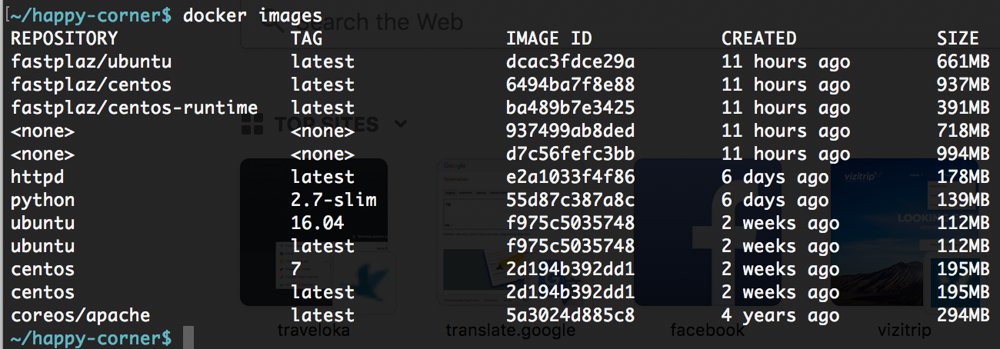

# FastPlaz Docker Template (Centos)


## Introduction

Scripts in this repository will show you how to make docker images and use it to deploy fastplaz application. Deploy your FastPlaz Application will more easy and no need much effort. With Docker Compose you can deploy application in many server in simple step.

**FastPlaz** is one of the web framework that created with free pascal programming language. FastPlaz is very fast, lite and simple. Fastplaz has templating support, lots of plugins integration and Simple ORM (Object-Relational Mapping). FastPlaz can be used in shared hosting, not just in vps or dedicated server.
The official FastPlaz site can be found [fastplaz.com](http://www.fastplaz.com).

[**Docker**](http://www.fastplaz.com) is a tool designed to make it easier to create, deploy, and run applications by using containers. Containers allow a developer to package up an application with all of the parts it needs, such as libraries and other dependencies, and ship it all out as one package.

Docker is a tool that is designed to benefit both developers and system administrators, making it a part of many DevOps (developers + operations) toolchains.

This docker template use OS Centos 7.4

## How to use
### Generate Image

Make sure Docker is running and have good internet access, 
then run this script

```
$./build.sh [runtime]
```

This script will produce image: **fastplaz/centos**.

You can see from this command

```
$docker images
```



### Run Container

From Shell, run this script

```
$./container-run.sh [runtime]
```


### Enter Container Bash Shell

From Shell, run this script

```
$./bash.sh [runtime]
```

or with manual command:

```
$docker run -it -p 8080:80 fastplaz/centos bash
```

#### Enter to existing active container

find your active container:

```
$docker ps
```

then execute this command:

```
$docker exec -it -p 8080:80 [container_id] bash
```


## Hack On

That’s about it. Thanks for listening. I’ll be quiet from now on (unless there’s an update about the app—I’ll remind you for that!).

Cheers ..!


